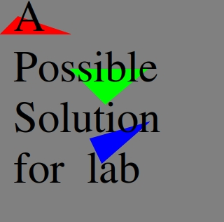

# Lab 2 - C++ Software Rasterizer - Lines and Triangles

> Fundamentals of C++ && Fundamentals of Graphics

**Lab materials must be pushed to your repository one week from now before the next class begins**

**Read:** *Labs are designed to be finished in class if you work diligently, but expected to take 1-2 hours outside of class. They are often more 'tutorial' in style, and sometimes the solution may even be provided in pieces for you to type in and experiment. Copying & Pasting is discouraged however--make mistakes, play, and you will further learn the material.*

# Logistics

You will be working on your own laptop today. For this lab you will need to be able to view PPM images.

# Resources to help

Some additional resources to help you through this lab assignment

- C++ Related
	- Reference on C++
  		- http://www.cplusplus.com/
	- Another nice tutorial on the C++ language.
  		- https://www.learncpp.com/
- Lab Related
	- A slideshow on Line Drawing
	  - https://inst.eecs.berkeley.edu/~cs150/fa10/Lab/CP3/LineDrawing.pdf
	- Rasterization resource 0
	  - http://www.sunshine2k.de/coding/java/TriangleRasterization/TriangleRasterization.html
	  - Follow up article with more discussion: http://www.sunshine2k.de/coding/java/Bresenham/RasterisingLinesCircles.pdf
	- Rasterization resource 1
	  - https://medium.com/@thiagoluiz.nunes/rasterization-algorithms-computer-graphics-b9c3600a7587
	- Rasterization resource 2
	  - http://developers-club.com/posts/257107/
	- Rasterization resource 3
	  - https://www.scratchapixel.com/lessons/3d-basic-rendering/rasterization-practical-implementation
	- Rasterization resource 4 (Video on Barycentric coordinates)
	  - https://www.youtube.com/watch?v=HYAgJN3x4GA

## How do I view a PPM image?

1. On linux type `display myImage.ppm` (You may need to install image magick library)
2. Download your respository locally after you commit any changes. Then view your .ppm in an image editor like GIMP(https://www.gimp.org).
<!-- 3. If you are working on the Khoury servers, depending on your terminal and ssh client, you can actually view images. Your client will need X11 support(https://unix.stackexchange.com/questions/276168/what-is-x11-exactly), which is the protocol for viewing imagse across ssh. 
	- Note when you ssh, you will perform `ssh -Y khouryname@login.khoury.neu.edu`
-->
4. (least recommended) Use this web interface and drag in your PPM: http://paulcuth.me.uk/netpbm-viewer/

# Description

In lab 1 we discovered if we can properly run OpenGL 4.1 or greater on our machines using the SDL library. Before we use a hardware accelerated graphics library ut we are going to travel back in time a bit and understand how rasterization takes place in graphics by building a small part of a software rasterizer. This will also allow us to continue building our C++ skills.

Software Rasterizeres (or Software Renders) while not optimal for real-time performance are still used today for:

- Offline rendering tasks
- Debugging GPU code by emulating graphics on the CPU 
	- ([Example in Apple](https://en.wikipedia.org/wiki/Core_OpenGL)).
	- Your instructor worked on an internal software rendering project for a big company in 2016.
- In some cases it may be more optimal to rasterize 'small triangles' on the CPU rather than transferring them to GPU (ancedotal note that this is what Unreal Engine 5 does).
- A fallback renderer if there is no GPU hardware available.
	- [Swift Shader sold to Google for 15 million in 2016](https://finance.yahoo.com/news/transgaming-announces-assignment-swiftshader-ip-202600923.html)
- A great way to understand graphics programming!

For this lab, you will build the **g**reat **l**ooking software render (Note: I had to find a cool name that had a 'gl' prefix).

## Part 1 - Setting up your Environment

For this lab, you only need run [python3 build.py](./build.py) to compile the source code from a terminal. 

## Part 2 - Filled in Triangles

Today's lab is a bit of a thinking exercise. You will have to think about how to rasterize and fill in a triangle. Your goal is to generate a .ppm image with 3 differently colored triangles.

### Tips

1. Make sure glFillMode (from [include/GL.h](./include/GL.h)) is set to FILL when you are drawing your triangle.

# Submission/Deliverables

### Submission

- Commit all of your files to github, including any additional files you create.
- Do not commit any binary files unless told to do so.
- Do not commit any 'data' files generated when executing a binary.

### Deliverables

- Implement `void triangle(Vec2 v0, Vec2 v1, Vec2 v2,Image& image, ColorRGB c)` and make three calls to the function so that when run a single image showing three differently filled colored triangles are displayed.
	- See below for a possible solution of what your lab will look like.
	- 
- Upload an image called [lab.jpg](./lab.jpg) to this repository showing your working window 
  	- **Name it exactly** as shown, all lowercase and a .jpg extension.

# Rubric

You (and any partner(s)) will receive the same grade from a scale of 0-2.

- 0 for no work completed by the deadline
- 1 for some work completed, but something is not working properly
- 2 for a completed lab (with possible 'going further' options completed)

# Going Further

What is that, you finished Early? Did you enjoy this lab? Here are some (optional) ways to further this assignment.

- Wu's Algorithm 
  - https://en.wikipedia.org/wiki/Xiaolin_Wu%27s_line_algorithm
- Consider optimizing Bresenham's algorithm
  - http://www.idav.ucdavis.edu/education/GraphicsNotes/Bresenhams-Algorithm.pdf

# F.A.Q. (Instructor Anticipated Questions)

- Q: `display` is not working--what do I do?
  - A: You may need install imagemagick, otherwise you can use a image program like GIMP to view the image.
- Q: My triangles are not filled
  - A: You may need to add a 'round' function `int y = std::round(v0.y*(1.0f-t) + v1.y*t);`
  - A: Additionally,  you may need to check if you are drawing a single pixel.
- Q: How would I compile this lab by hand?
  - A: `clang++ -std=c++17 ./src/image.cpp ./src/main.cpp -I ./include -o main`
  - If **clang++** is not available, you may use **g++** instead (likely folks on Windows or the virtual machine will use g++).

# Found a bug?

If you found a mistake (big or small, including spelling mistakes) in this lab, kindly send me an e-mail. It is not seen as nitpicky, but appreciated! (Or rather, future generations of students will appreciate it!)

- Fun fact: The famous computer scientist Donald Knuth would pay folks one $2.56 for errors in his published works. [[source](https://en.wikipedia.org/wiki/Knuth_reward_check)]
- Unfortunately, there is no monetary reward in this course :)
